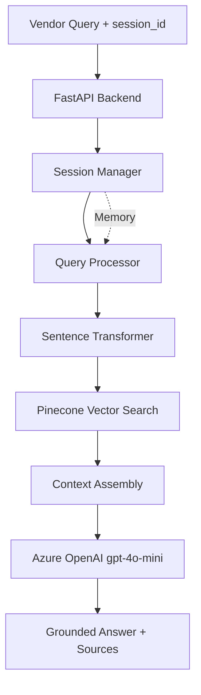

# MakeMyTrip Cab Vendor Travel Assist Chatbot

A production-grade RAG-based chatbot that helps cab vendors integrate with the MakeMyTrip platform by answering queries from integration documentation.

## Features

- **RAG Architecture**: Retrieval-Augmented Generation using Pinecone vector store and Azure OpenAI
- **Semantic Search**: Powered by Sentence Transformers (all-MiniLM-L6-v2)
- **Session Memory**: Maintains conversational context with automatic summarization
- **Anti-Hallucination**: Strict prompt engineering and similarity thresholds prevent incorrect answers
- **Production-Ready**: Structured logging, error handling, and observability

## Architecture



## Prerequisites

- Python 3.10 or higher
- Azure OpenAI account with access to gpt-4o-mini
- Pinecone account (Free tier supported)

## Quick Start

Get up and running in 5 minutes:

```bash
# 1. Clone and setup
git clone <repository-url>
cd cab-travelAssist-chatbot
python -m venv venv
source venv/bin/activate  # On Windows: venv\Scripts\activate

# 2. Install dependencies
pip install -r requirements.txt

# 3. Configure environment
cp .env.example .env
# Edit .env with your Azure OpenAI and Pinecone credentials

# 4. Start the server
python -m uvicorn backend.app.main:app --reload --port 8000

# 5. In another terminal, ingest the documentation
curl -X POST http://localhost:8000/ingest

# 6. Test the chatbot
curl -X POST http://localhost:8000/chat \
  -H "Content-Type: application/json" \
  -d '{"session_id": "test-1", "user_query": "How do I call the search API?"}'
```

## Installation

1. **Clone the repository**
   ```bash
   git clone <repository-url>
   cd cab-travelAssist-chatbot
   ```

2. **Create a virtual environment**
   ```bash
   python -m venv venv
   source venv/bin/activate  # On Windows: venv\Scripts\activate
   ```

3. **Install dependencies**
   ```bash
   pip install -r requirements.txt
   ```

4. **Configure environment variables**
   ```bash
   cp .env.example .env
   # Edit .env with your API keys and configuration
   ```

   Required configuration:
   - `AZURE_OPENAI_KEY`: Your Azure OpenAI API key
   - `AZURE_OPENAI_ENDPOINT`: Your Azure OpenAI endpoint URL
   - `PINECONE_API_KEY`: Your Pinecone API key
   - `PINECONE_ENVIRONMENT`: Your Pinecone environment (e.g., `gcp-starter`)

5. **Verify installation**
   ```bash
   python -c "import fastapi, sentence_transformers, pinecone; print('All dependencies installed!')"
   ```

## Configuration

Edit the `.env` file with your credentials:

```env
# Azure OpenAI
AZURE_OPENAI_KEY=your_azure_key
AZURE_OPENAI_ENDPOINT=https://your-endpoint.openai.azure.com
AZURE_OPENAI_DEPLOYMENT=gpt-4o-mini
AZURE_OPENAI_API_VERSION=2025-01-01-preview

# Pinecone
PINECONE_API_KEY=your_pinecone_key
PINECONE_ENVIRONMENT=your_pinecone_env
PINECONE_INDEX_NAME=mmt-cab-docs
```

## Usage

### 1. Start the API Server

```bash
uvicorn backend.app.main:app --reload --port 8000
```

The API will be available at `http://localhost:8000`

### 2. Ingest Documentation (One-time Setup)

Before using the chatbot, ingest the documentation into the vector store:

```bash
curl -X POST http://localhost:8000/ingest
```

This process:
- Chunks the `documentation.txt` file into semantic segments
- Generates embeddings using Sentence Transformers
- Uploads to Pinecone vector store

Expected output:
```json
{
  "status": "success",
  "chunks_created": 250,
  "time_taken_seconds": 45.2
}
```

### 3. Chat with the Bot

```bash
curl -X POST http://localhost:8000/chat \
  -H "Content-Type: application/json" \
  -d '{
    "session_id": "vendor-session-123",
    "user_query": "How do I call the search API?"
  }'
```

Response:
```json
{
  "session_id": "vendor-session-123",
  "answer": "The Search API is called by sending a POST request to the partner search endpoint...",
  "sources": ["Normal Booking Flow - Search", "API Flowchart"],
  "confidence": "high",
  "metadata": {
    "retrieved_chunks": 4,
    "avg_similarity": 0.82,
    "latency_ms": 450
  }
}
```

### 4. Interactive API Documentation

Visit `http://localhost:8000/docs` for Swagger UI with interactive API testing.

## API Endpoints

### Health Check
```
GET /health
```

### Document Ingestion
```
POST /ingest
```
One-time ingestion of documentation into the vector store.

### Chat
```
POST /chat
```
Main chatbot endpoint for vendor queries.

**Request:**
```json
{
  "session_id": "string",
  "user_query": "string"
}
```

**Response:**
```json
{
  "session_id": "string",
  "answer": "string",
  "sources": ["string"],
  "confidence": "high|medium|low|none",
  "metadata": {
    "retrieved_chunks": 0,
    "avg_similarity": 0.0,
    "latency_ms": 0
  }
}
```

## Example Queries

The chatbot can answer questions like:

### Onboarding & Setup
- "How do I onboard as a cab vendor?"
- "What authentication method should I use?"
- "What is the base URL for the API?"

### API Usage
- "What are the mandatory fields in the Search API?"
- "How do I call the Block API?"
- "What is the difference between Block and Paid API?"
- "What are the post-booking APIs I need to implement?"

### Booking Flow
- "Explain the normal booking flow"
- "What happens after a customer selects a cab?"
- "What is the timeframe between block and confirm?"

### Error Handling & Edge Cases
- "How do I handle trip cancellation?"
- "What should I do if a customer doesn't board?"
- "How do I update driver location?"

### Follow-up Questions
The chatbot maintains conversation context, so you can ask follow-up questions:
- User: "Tell me about the Search API"
- Bot: [Explains Search API]
- User: "What are the mandatory parameters?"
- Bot: [Lists mandatory parameters for Search API from context]

## Features in Detail

### Anti-Hallucination Controls

1. **Strict System Prompt**: Instructs the LLM to answer only from provided context
2. **Similarity Threshold**: Filters out irrelevant chunks (threshold: 0.65)
3. **Source Citation**: Every answer includes source sections from documentation
4. **Graceful Refusal**: Out-of-scope questions receive polite refusal

### Session Memory

- Maintains conversation history per session
- Automatically summarizes long conversations (>5 turns)
- Enables natural follow-up questions ("What about that API?")

### Semantic Understanding

Handles synonyms and paraphrasing:
- "cancel ride" ≈ "trip cancellation"
- "callback" ≈ "webhook"
- "driver update" ≈ "status notification"

## Project Structure

```
cab-travelAssist-chatbot/
├── backend/
│   ├── app/
│   │   ├── main.py              # FastAPI application
│   │   ├── api/                 # API endpoints
│   │   ├── core/                # Configuration
│   │   ├── services/            # Business logic
│   │   ├── models/              # Pydantic models
│   │   └── utils/               # Utilities
│   └── tests/                   # Test suite
├── documentation.txt            # Knowledge base
├── requirements.txt             # Dependencies
└── .env                         # Configuration
```

## Development

### Running Tests

Run the test suite:

```bash
# Run all tests
pytest backend/tests/ -v

# Run specific test file
pytest backend/tests/test_chunker.py -v

# Run with coverage
pytest backend/tests/ --cov=backend.app --cov-report=html

# Run only fast tests (skip integration tests)
pytest backend/tests/ -v -m "not slow"
```

### Code Quality

The codebase follows best practices:
- **Type Hints**: Full type annotations throughout for better IDE support
- **Pydantic Models**: Data validation for all API requests/responses
- **Structured Logging**: JSON-formatted logs with contextual information
- **Error Handling**: Comprehensive exception handling with graceful fallbacks
- **Singleton Patterns**: Efficient resource management for services
- **Async/Await**: Non-blocking operations where appropriate

### Project Guidelines

- Follow PEP 8 style guide
- Use descriptive variable and function names
- Add docstrings to all public functions
- Keep functions focused and under 50 lines when possible
- Write tests for new features
- Update README when adding new features

### Adding New Features

1. **New Service**: Add to `backend/app/services/`
2. **New Endpoint**: Add to `backend/app/api/`
3. **New Model**: Add to `backend/app/models/`
4. **Configuration**: Update `backend/app/core/config.py` and `.env.example`
5. **Tests**: Add tests to `backend/tests/`
6. **Documentation**: Update this README

## Monitoring

Key metrics logged:
- Query retrieval accuracy (similarity scores)
- Response latency
- Session engagement
- Out-of-scope query rate

Logs are structured for easy parsing and monitoring.

## Troubleshooting

### "No relevant chunks found"
- Ensure ingestion completed successfully: `curl http://localhost:8000/ingest/status`
- Check if query is related to cab integration (out-of-scope queries will return this message)
- Try rephrasing the question with specific API names or keywords

### Low similarity scores / Confidence: "low"
- Question may be out of scope for the documentation
- Try being more specific (e.g., "Search API mandatory fields" vs "API fields")
- Include relevant keywords (API names, workflow terms like "booking", "block", "paid")

### Azure OpenAI errors
- Verify API key and endpoint in `.env` file
- Check deployment name matches configuration (`gpt-4o-mini`)
- Ensure quota is not exceeded in Azure portal
- Check API version matches: `2025-01-01-preview`

### Pinecone errors
- Verify API key and environment in `.env`
- Ensure index exists (created automatically during first ingestion)
- Check network connectivity to Pinecone
- Try deleting and recreating the index with `force_reindex=true`

### Module import errors
- Ensure you're running commands from the project root directory
- Check that virtual environment is activated
- Verify all dependencies are installed: `pip install -r requirements.txt`

### Slow response times
- First query after startup is slower (model loading)
- Check Pinecone latency (should be <100ms)
- Check Azure OpenAI latency (should be <1s)
- Review logs for bottlenecks: `grep "latency_ms" logs/`

## Production Considerations

For production deployment, consider these enhancements:

### Infrastructure
- **Redis for Session Storage**: Replace in-memory session storage with Redis for persistence
- **Load Balancing**: Deploy multiple instances behind a load balancer
- **HTTPS**: Use TLS/SSL certificates for secure communication
- **CDN**: Cache static assets if adding a frontend

### Security
- **API Authentication**: Implement JWT or API key-based authentication
- **Rate Limiting**: Add rate limiting per vendor/session
- **CORS**: Restrict `allow_origins` to specific domains
- **Input Validation**: Additional sanitization for user queries
- **Secrets Management**: Use Azure Key Vault or AWS Secrets Manager

### Monitoring & Observability
- **Application Monitoring**: Integrate with Datadog, New Relic, or Application Insights
- **Log Aggregation**: Use ELK stack or CloudWatch for centralized logging
- **Metrics Tracking**:
  - Query volume and latency
  - Retrieval accuracy (similarity scores)
  - Hallucination rate (manual sampling)
  - Session engagement metrics
- **Alerting**: Set up alerts for:
  - High error rates
  - Slow response times (>3s)
  - Service failures (Pinecone, Azure OpenAI)

### Performance
- **Caching**: Cache frequent queries and responses
- **Async Processing**: Batch processing for multiple sessions
- **Model Optimization**: Consider quantized models for faster inference
- **Connection Pooling**: Reuse connections to Pinecone and Azure

### Reliability
- **Retry Logic**: Exponential backoff for transient failures
- **Circuit Breakers**: Prevent cascade failures
- **Graceful Degradation**: Fallback responses when services are down
- **Health Checks**: Kubernetes-ready health endpoints

### Maintenance
- **Automated Re-ingestion**: Webhook or scheduled job when documentation updates
- **Version Control**: Track documentation versions and embeddings
- **A/B Testing**: Compare different chunking strategies or prompts
- **Feedback Loop**: Collect user feedback (thumbs up/down) for quality improvement

## License

[Your License Here]

## Support

For issues or questions, contact [Your Contact Information]
